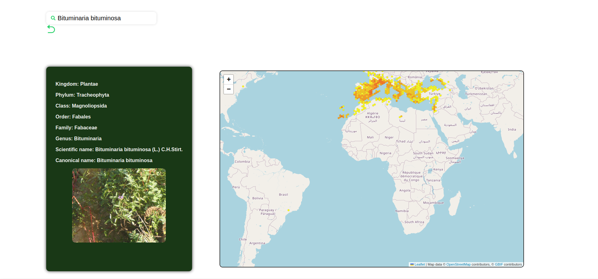

# Web Application for Species Search with React and GBIF API

Welcome to our species search web application, where you can explore a wide variety of organisms using their scientific names.

## Key Features

- **Search by Scientific Name:** Utilize our search functionality to find detailed information about any species using its scientific name.
  
- **Species Details:** Obtain accurate details about the searched species, including information about its geographical distribution, taxonomy, and more.
  
- **Interactive Map:** Visualize the geographical distribution of species using an interactive map provided by OpenStreetMap.

## Technologies Used

This application makes use of the following technologies:

- **React:** A JavaScript library for building interactive user interfaces.

- **Vite:** A fast development environment for modern web projects. Vite handles project configuration, providing an efficient development workflow and fast real-time updates during development.

- **React-Leaflet:** A React library for working with interactive maps based on Leaflet. This library allows us to seamlessly integrate interactive maps into our application in a simple and efficient manner.

- **GBIF API:** The API provided by GBIF (Global Biodiversity Information Facility) for obtaining accurate data on biodiversity. We utilize this API to fetch detailed information about the species being searched.

- **OpenStreetMap:** A collaborative mapping platform that provides geospatial data and an interactive map for visualizing the geographical distribution of species.

## How It Works

1. **Species Search:**
   - Enter the scientific name of the species you are interested in into the search field.
   - Type the name of the species and click on the desired result.
   - The application will query the GBIF API to find information about the specified species.
   
2. **Details Visualization:**
   - Once the data is retrieved, the application will display details such as geographical distribution and taxonomy.
   
3. **Interactive Map:**
   - Along with species details, you'll be able to see an interactive map displaying the geographical distribution of the queried species. This map is powered by OpenStreetMap and GBIF and allows you to visually explore the distribution of the species.
<a href="https://gbif-react.netlify.app/specie/2952882">You can test the application here</a>

